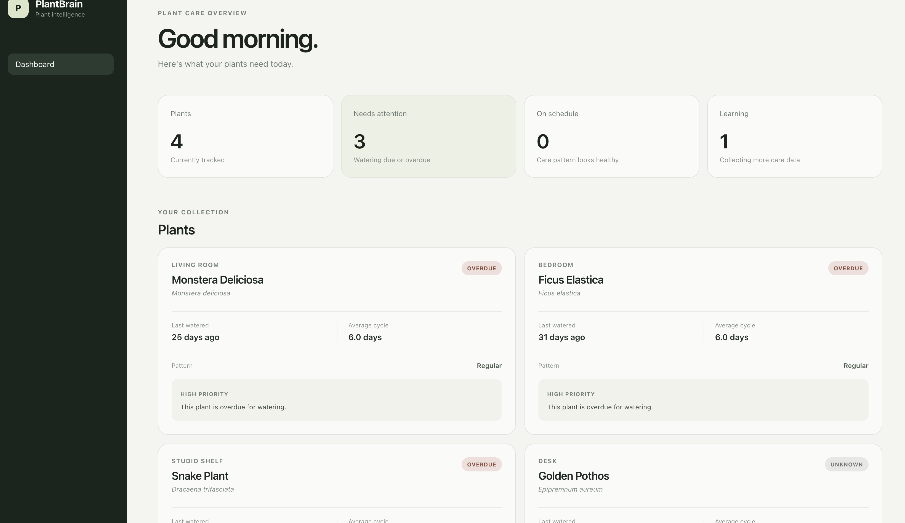
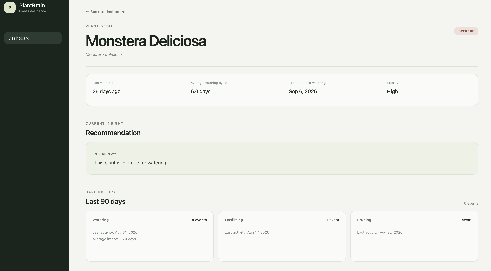
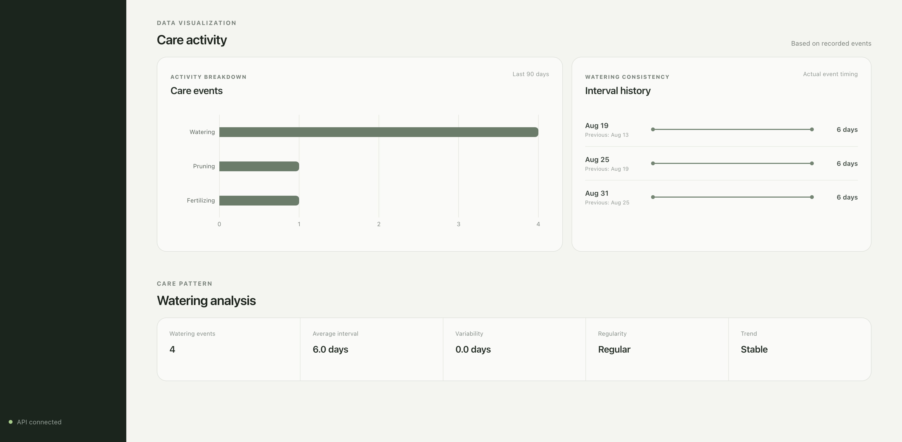
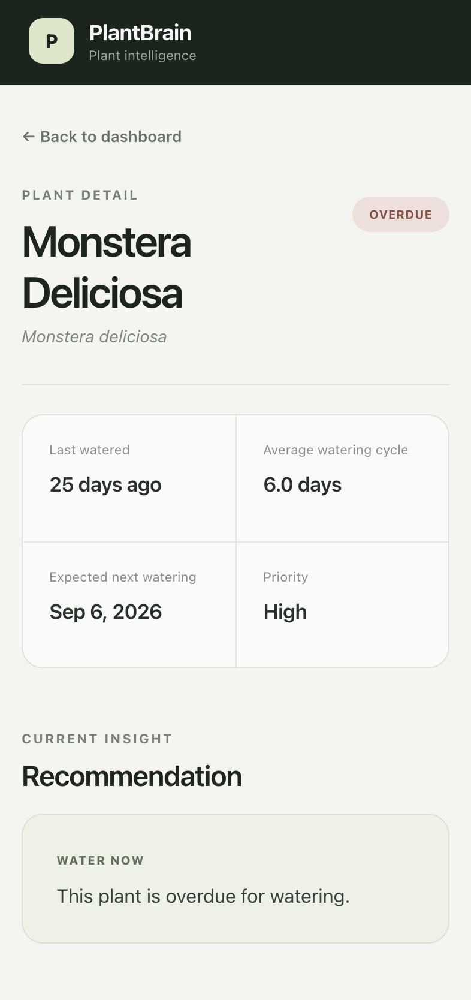

# PlantBrain

**A data-driven plant care system that turns care history into transparent, explainable insights.**

### Live Demo

**Frontend:** https://mahdisynj-ship-it.github.io/PlantBrain/

**Public API:** https://mahdisynj.pythonanywhere.com

The public portfolio demo runs with a read-only backend configuration. Visitors can explore the dashboard, plant details, care history, analytics, and recommendations without modifying the shared demo dataset.

**Deployment:** React/Vite frontend on GitHub Pages · FastAPI backend on PythonAnywhere · SQLite demo database

PlantBrain is a full-stack portfolio project exploring how structured plant-care records can be transformed into useful recommendations through simple statistical analysis and deterministic rules.

Rather than acting only as a CRUD tracker or fixed reminder system, PlantBrain analyzes a plant's own recorded care history, identifies patterns in watering behavior, evaluates current watering timing, and presents the reasoning through a responsive interface.

> **PlantBrain v1 does not use machine learning.**
>
> Its analytical layer is intentionally simple and explainable: recommendations are derived from recorded care events, interval statistics, and deterministic rules that can be traced and tested.

---

## Overview

Most basic plant-care trackers answer questions such as:

- When did I last water this plant?
- What care events have I recorded?
- When should I set the next reminder?

PlantBrain explores a different question:

> **What can the plant's own care history tell us about its current care needs?**

The system works with:

- plant information
- care events
- location and timezone context
- historical care intervals
- pattern statistics
- weather snapshots

and turns the relevant historical care data into explainable plant-care insights.

PlantBrain v1 focuses primarily on **watering behavior**.

---

## Product Preview

PlantBrain includes a responsive dashboard and plant-detail analytical view designed to make care history and derived insights easy to understand.

### Dashboard

The dashboard provides an overview of the demo plant collection and groups plants by their current care state.



Each plant card summarizes current watering status, recent watering timing, average watering cycle, historical regularity, and the current recommendation.

### Plant Detail

The plant-detail view exposes the reasoning behind the dashboard summary, including watering timing, expected next watering, recommendation priority, and recent care history.



### Care Analytics

Historical care events are transformed into simple, explainable visualizations and statistical summaries.



The analytical view shows recorded care-event frequency, actual watering intervals, average interval, variability, regularity, and interval trend.

### Responsive UI

PlantBrain is designed to preserve the same information hierarchy and recommendation logic on smaller screens.

<p align="center">
  
</p>

---

## What PlantBrain Actually Analyzes

The analytical layer in PlantBrain v1 is intentionally transparent.

It does not attempt to predict plant biology using a machine-learning model.

Instead, it asks:

1. When was this plant watered?
2. What were the intervals between watering events?
3. What is the average interval?
4. How much do those intervals vary?
5. Are the intervals becoming longer or shorter?
6. How does the current time compare with the plant's recent watering pattern?

These calculations are then translated into user-facing states and recommendations.

This approach was chosen because the goal of v1 is not maximum predictive complexity. The goal is to demonstrate a complete and testable path from:

```text
Recorded Data
      ↓
Statistical Analysis
      ↓
Rule-Based Interpretation
      ↓
Explainable Insight
      ↓
User-Facing Recommendation
```

---

## From Raw Data to Insight

PlantBrain separates source data from derived analysis.

```text
Plant
  │
  ├── Place / Timezone
  │
  ├── Care Events
  │      ├── Watering
  │      ├── Fertilizing
  │      ├── Pruning
  │      └── Repotting
  │
  └── Weather Snapshots
          │
          ▼
      Structured History
          │
          ▼
      Care Statistics
          │
          ▼
      Pattern Analysis
          │
          ▼
      Watering Analysis
          │
          ▼
         Insight
          │
          ▼
    Recommendation
          │
          ▼
         UI
```

For watering specifically:

```text
Watering timestamps
        ↓
Intervals between events
        ↓
Average interval + variability
        ↓
Regularity + interval trend
        ↓
Current watering timing
        ↓
Watering status
        ↓
Recommendation
```

Because these steps are deterministic, the final recommendation can be traced back to the recorded events that produced it.

---

## Core Features

PlantBrain v1 currently includes:

- Plant management
- Location management
- Multiple care-event types
- Weather snapshots associated with care events
- IANA timezone support
- UTC-normalized semantic timestamps
- Historical care statistics
- Watering interval analysis
- Care regularity classification
- Care interval trend analysis
- Watering status classification
- Explainable recommendations
- Deterministic demo scenarios
- Responsive React dashboard
- Plant-detail analytical view
- Care activity visualization
- Watering consistency visualization
- REST API
- Automated test suite
- Read-only public demo mode
- Public frontend and backend deployment

---

## Care Analysis

### Watering Status

PlantBrain uses historical watering timing to classify the current state.

Possible states are:

```text
unknown
not_due
due
overdue
```

When sufficient history exists, the system calculates the average watering interval and derives an expected next watering time.

The current time is then evaluated against that historical pattern.

A tolerance window is used around the expected watering time so that a plant does not move directly from `not_due` to `overdue` at a single exact timestamp.

---

## Care Regularity

PlantBrain calculates the intervals between repeated care events.

For event types with enough interval history, it evaluates variability relative to the average interval.

Possible classifications are:

```text
insufficient_data
regular
moderately_irregular
irregular
```

This is a simple statistical classification rather than a learned model.

Its purpose is to answer a practical question:

> Has this type of care been happening at roughly consistent intervals?

---

## Interval Trend

PlantBrain also evaluates whether care intervals are changing over time.

Possible states include:

```text
insufficient_data
stable
increasing_interval
decreasing_interval
```

The analysis compares earlier and later portions of the interval history.

This allows PlantBrain to distinguish between:

- consistent care
- increasingly spaced care
- increasingly frequent care

without treating those states as unexplained predictions.

---

## Explainable Recommendations

Analytical results are converted into a small set of user-facing actions.

Examples include:

```text
water_now
water_soon
monitor
collect_more_data
```

A recommendation contains:

- an action
- a priority
- a human-readable message

For example:

```text
Watering status: overdue
Priority: high
Action: water_now
```

The important architectural principle is that the recommendation is **derived**, not stored as the original source of truth.

If the underlying care history changes, the analysis can be recalculated.

---

## Weather: Current Role in V1

PlantBrain includes a weather layer and can associate weather snapshots with plant-care events.

Weather data can contain information such as:

- temperature
- humidity
- condition
- observation time
- source

The current implementation includes an Open-Meteo provider.

However, **PlantBrain v1 does not currently use weather conditions to modify watering recommendations or care-pattern classifications.**

This is intentional.

The weather layer currently demonstrates:

- integration with an external data source
- environmental context attached to historical events
- timezone-aware weather timestamps
- a data foundation for future environmental analysis

Using weather to modify watering recommendations would require additional assumptions about factors such as plant species, indoor/outdoor conditions, soil, sunlight, temperature exposure, and humidity.

Rather than introduce an unsupported rule such as "hot weather means water sooner," v1 keeps the recommendation engine based on the care history it can explain directly.

---

## Architecture

For a detailed view of the system architecture, data model, analytical pipeline, and timezone strategy, see:

**[PlantBrain Architecture Documentation](docs/ARCHITECTURE.md)**

At a high level:

```text
React Frontend
      │
      │ HTTP / JSON
      ▼
FastAPI API
      │
      ▼
Service Layer
      │
      ├── Plant / Place Services
      ├── Event Services
      ├── Weather Services
      ├── Care History Service
      ├── Care Pattern Service
      ├── Care Analysis Service
      └── Plant Insight Service
      │
      ▼
SQLAlchemy Models
      │
      ▼
SQLite
```

The analytical logic lives in dedicated service modules rather than inside React components or API endpoint functions.

---

## Design Decisions & Trade-offs

PlantBrain v1 deliberately favors clarity, testability, and explainability over production-scale complexity.

### Why FastAPI?

FastAPI was selected because the project is strongly API- and data-oriented.

It provides:

- clear request and response models
- straightforward dependency injection
- automatic OpenAPI documentation
- strong integration with Python type hints
- a lightweight structure suitable for separating API endpoints from analytical services

For a larger application with extensive server-rendered features, built-in administration, or a broader monolithic product surface, a framework such as Django could offer different advantages.

For PlantBrain's current scope, FastAPI keeps the backend focused on its REST and analytical responsibilities.

### Why SQLite?

PlantBrain v1 is a portfolio and demonstration system rather than a multi-user production SaaS.

SQLite provides:

- simple local setup
- no separate database server
- deterministic demo behavior
- easy development and testing
- sufficient relational modeling for the current scope

A production multi-user deployment would likely require moving to a database such as PostgreSQL.

Keeping SQLite in v1 avoids adding infrastructure that would not demonstrate additional analytical capability.

### Why SQLAlchemy and Alembic?

The application still benefits from explicit relational models and controlled schema evolution even though it uses SQLite.

SQLAlchemy provides the ORM layer, while Alembic records database migrations as the model evolves.

This keeps database changes reproducible rather than relying on an undocumented local database state.

### Why Normalize Time to UTC?

Care events happen in local time, but plants can belong to places with different timezones.

Storing timestamps without a consistent temporal contract can make historical comparisons unreliable.

PlantBrain therefore treats timezone handling as part of the domain model:

```text
Local Event Time
      ↓
Plant Place Timezone
      ↓
Normalize to UTC
      ↓
Store
      ↓
Convert back to local context when required
```

This adds implementation complexity, but prevents care analysis from depending on the machine's local timezone.

### Why Statistical and Rule-Based Analysis Instead of Machine Learning?

Machine learning would increase the apparent technical complexity of the project, but PlantBrain does not currently have the volume or quality of biological training data required to justify such a model.

Using ML in that situation could make recommendations harder to explain without making them more trustworthy.

PlantBrain v1 therefore uses:

- event intervals
- averages
- interval variability
- simple trend comparison
- deterministic status rules

The trade-off is limited predictive sophistication in exchange for:

- transparency
- reproducibility
- testability
- explainability

This is a deliberate product and engineering decision.

### Why Keep Weather if It Does Not Drive Recommendations Yet?

Weather integration establishes environmental context and demonstrates the ability to combine internal event data with an external provider.

The trade-off is that the current model contains contextual data that is not yet part of the recommendation calculation.

Rather than hide that limitation, PlantBrain documents it explicitly.

A future version could investigate whether weather meaningfully improves recommendations once enough relevant variables and evidence are available.

### Why No Authentication in V1?

Authentication is intentionally outside the v1 scope.

Implementing accounts, sessions, authorization, password recovery, and user ownership would add substantial product surface without strengthening the central data-to-insight demonstration.

The deployed portfolio version therefore runs in **read-only demo mode**. Public visitors can inspect the shared dataset and analytical results, while data-modifying requests are rejected by the backend.

This keeps the live project explorable without introducing a full authentication system solely for demonstration purposes.

### Why Deterministic Demo Data?

A portfolio reviewer should not have to spend days recording watering events before the analytical features become visible.

The seed script creates controlled scenarios representing states such as:

- regular care
- overdue watering
- irregular intervals
- insufficient data

This makes the analytical behavior immediately inspectable and reproducible.

---

## Data Model

The main persisted entities are:

```text
Place
  │
  └── Plant
        │
        └── Plant Event
                │
                └── Weather Snapshot
```

### Place

Stores location context such as:

- name
- city
- latitude
- longitude
- timezone

### Plant

Stores plant identity and links a plant to a place.

### Plant Event

Represents a recorded care action such as:

- watering
- fertilizing
- pruning
- repotting

### Weather Snapshot

Stores environmental context associated with a care event.

Derived insights and recommendations are not treated as the original source data.

---

## Backend Structure

```text
app/
├── api/
│   └── main.py
│
├── database/
│   ├── base.py
│   ├── session.py
│   └── models/
│       ├── place.py
│       ├── plant.py
│       ├── plant_event.py
│       └── weather_snapshot.py
│
├── schemas/
│   ├── care_analysis.py
│   ├── care_history.py
│   ├── care_pattern.py
│   ├── place.py
│   ├── plant.py
│   ├── plant_event.py
│   ├── plant_insight.py
│   └── weather_snapshot.py
│
├── services/
│   ├── care_analysis_service.py
│   ├── care_history_service.py
│   ├── care_pattern_service.py
│   ├── event_service.py
│   ├── event_weather_service.py
│   ├── open_meteo_provider.py
│   ├── place_service.py
│   ├── plant_insight_service.py
│   ├── plant_service.py
│   ├── weather_provider.py
│   └── weather_service.py
│
└── utils/
    └── datetime_utils.py
```

---

## Frontend Structure

```text
frontend/src/
├── api/
│   └── plantBrainApi.js
│
├── components/
│   └── CareVisualizations.jsx
│
├── App.jsx
├── App.css
├── index.css
└── main.jsx
```

The frontend retrieves analytical results from the API rather than reproducing the backend decision rules.

---

## Tech Stack

### Backend

- Python
- FastAPI
- SQLAlchemy
- Pydantic
- Alembic
- SQLite
- Pytest

### Frontend

- React
- Vite
- JavaScript
- CSS
- Recharts

### External Data

- Open-Meteo

### Deployment

- GitHub Pages — frontend
- PythonAnywhere — FastAPI backend
- GitHub Actions — frontend build and deployment
- SQLite — deterministic public demo dataset

---

## API

Examples of the REST endpoints used by the application include:

```http
GET /plants
GET /plants/{plant_id}/events
GET /plants/{plant_id}/care-history
GET /plants/{plant_id}/care-pattern
GET /plants/{plant_id}/insights
```

A plant insight response combines multiple analytical results into a frontend-friendly representation.

Example:

```json
{
  "plant_id": 1,
  "plant_name": "Ficus",
  "watering": {
    "status": "due",
    "days_since_last_watering": 6.4,
    "average_interval_days": 6.0,
    "expected_next_watering_at": "2026-09-10T10:00:00"
  },
  "pattern": {
    "regularity": "regular",
    "trend": "stable"
  },
  "recommendation": {
    "action": "water_soon",
    "priority": "medium",
    "message": "This plant will likely need watering soon."
  }
}
```

FastAPI provides interactive OpenAPI documentation while the backend is running.

The public deployment exposes read operations for portfolio exploration while data-modifying requests are blocked in demo mode.

---

## Demo Data

PlantBrain includes a deterministic demo-data generator:

```bash
python -m scripts.seed_demo_data
```

The seed creates multiple plants with intentionally different histories.

This allows the UI to demonstrate analytical states such as:

```text
regular + due
regular + overdue
irregular + not_due
insufficient_data
```

Demo records are explicitly marked so they can be distinguished from other local records.

The deployed portfolio demo uses this deterministic dataset so analytical behavior is immediately visible to reviewers.

---

## Testing

The automated test suite covers areas including:

- API behavior
- plant services
- event services
- places
- weather
- external weather-provider behavior
- timezone utilities
- care history
- care analysis
- care patterns
- insight generation
- public demo read-only behavior

Current PlantBrain v1 checkpoint:

```text
163 tests passing
```

Run the suite with:

```bash
pytest -q
```

---

## Running PlantBrain Locally

### 1. Clone the repository

```bash
git clone <repository-url>
cd PlantBrain
```

### 2. Create and activate a virtual environment

```bash
python -m venv .venv
source .venv/bin/activate
```

### 3. Install backend dependencies

```bash
pip install -e .
```

### 4. Apply database migrations

```bash
alembic upgrade head
```

### 5. Seed demo data

```bash
python -m scripts.seed_demo_data
```

### 6. Start the backend

```bash
python -m uvicorn app.api.main:app --reload
```

Backend:

```text
http://127.0.0.1:8000
```

### 7. Start the frontend

In a second terminal:

```bash
cd frontend
npm install
npm run dev
```

Frontend:

```text
http://localhost:5173
```

---

## Production Build

The frontend API URL can be configured through:

```text
VITE_API_BASE_URL
```

Build the frontend with:

```bash
cd frontend
npm run build
```

The public GitHub Pages deployment injects the deployed backend URL during the GitHub Actions build.

---

## Public Demo Deployment

The portfolio version is deployed as a split frontend/backend application:

```text
GitHub Pages
     │
     │ HTTPS / JSON
     ▼
PythonAnywhere
     │
     ▼
FastAPI
     │
     ▼
SQLite Demo Database
```

The frontend is built with Vite and deployed automatically through GitHub Actions.

The backend runs the FastAPI application on PythonAnywhere and uses the deterministic SQLite demo dataset.

The deployed backend runs with:

```text
PLANTBRAIN_DEMO_MODE=true
```

In this mode, read requests remain available while data-modifying requests are rejected.

This allows reviewers to explore the application without changing the shared portfolio dataset.

---

## V1 Scope and Limitations

PlantBrain v1 intentionally does **not** include:

- authentication
- multiple users
- payments
- notifications
- native mobile apps
- IoT sensors
- machine-learning models
- LLM-generated recommendations
- disease detection
- greenhouse management
- social features

It also does not claim that historical watering intervals alone are sufficient to determine a plant's biological water requirements.

The recommendation engine should be understood as an **explainable analysis of recorded care behavior**, not as a replacement for horticultural expertise.

See [`PLANTBRAIN_V1_SCOPE.md`](PLANTBRAIN_V1_SCOPE.md) for the dedicated scope document.

---

## Current Status

PlantBrain v1 is feature-complete and publicly deployed as a portfolio demo.

Implemented:

- relational backend data model
- Alembic migrations
- plant and place management
- care-event tracking
- weather snapshots
- Open-Meteo integration
- timezone-aware processing
- UTC normalization
- care-history statistics
- care-pattern analysis
- watering analysis
- explainable insight generation
- deterministic demo data
- responsive React dashboard
- plant-detail analytics
- care visualizations
- automated test suite
- architecture documentation
- product screenshots
- GitHub Pages frontend deployment
- FastAPI backend deployment
- read-only public demo protection
- live frontend-to-API integration

Remaining portfolio work:

- final repository cleanup
- portfolio case study presentation

---

## Project Goals

PlantBrain was built to demonstrate work across:

- product thinking
- data modeling
- API design
- backend development
- statistical reasoning
- deterministic decision logic
- automated testing
- external API integration
- frontend development
- data visualization
- responsive UI design
- technical documentation
- deployment
- explainable data-driven decision support

The central idea is not simply to store plant-care data.

It is to demonstrate the reasoning layer between:

**what was recorded → what the data suggests → what the user sees.**