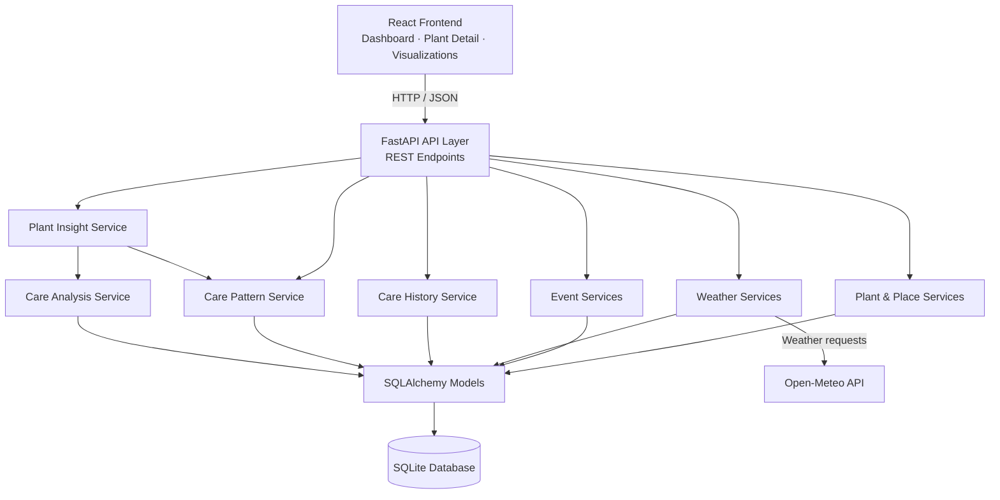
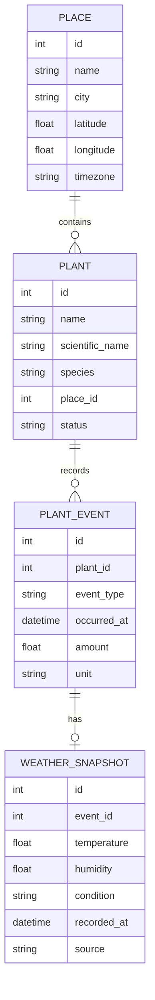
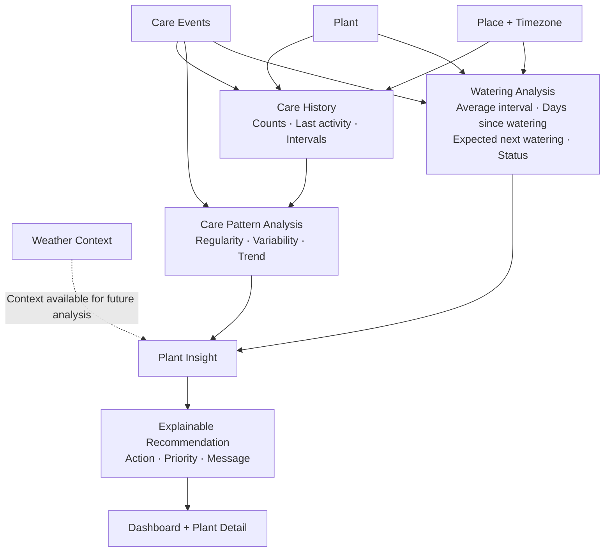
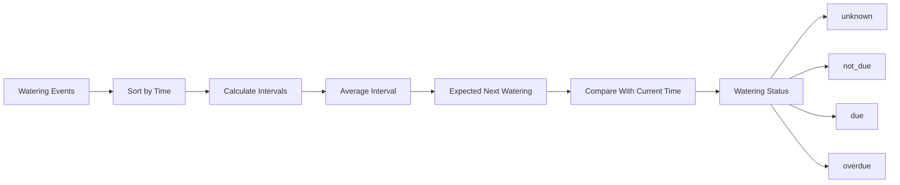
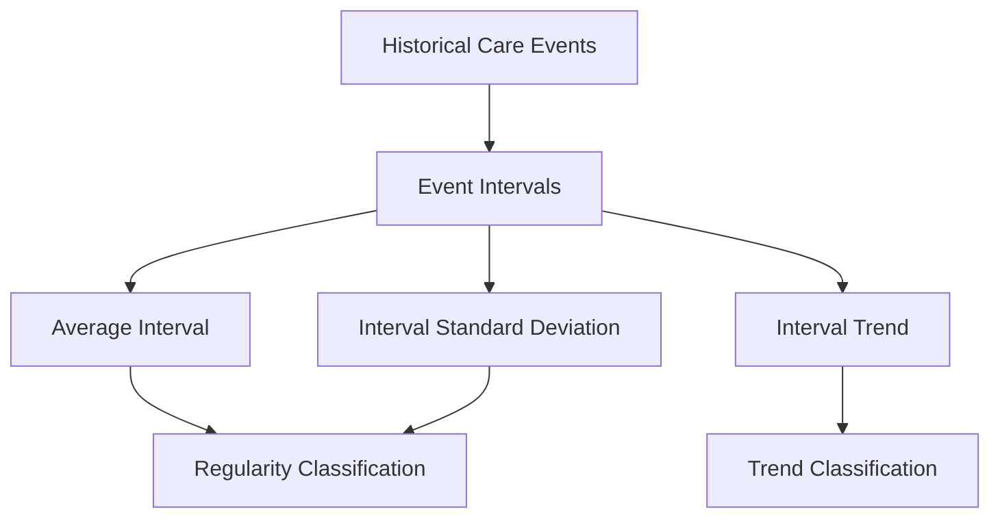
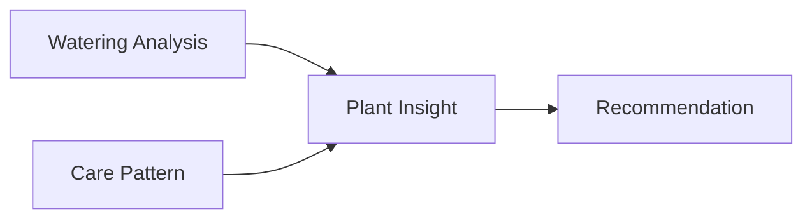
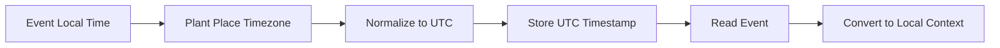
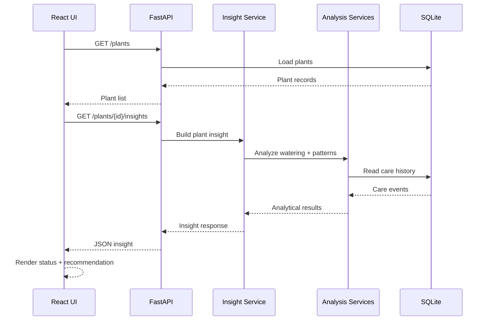

# PlantBrain Architecture

This document describes the technical architecture and analytical data flow of PlantBrain v1.

PlantBrain is structured so that data storage, business logic, analytical logic, API delivery, and user-interface presentation remain separated.

---

## 1. System Architecture



### Layer Responsibilities

**React Frontend**

Presents the user-facing dashboard, plant-detail analytics, recommendations, and care visualizations.

**FastAPI API Layer**

Exposes REST endpoints and translates HTTP requests into service-layer operations.

**Service Layer**

Contains the application's business and analytical logic. This includes plant management, event processing, weather handling, historical statistics, care-pattern analysis, watering analysis, and insight generation.

**SQLAlchemy Models**

Represent persisted entities and relationships.

**SQLite**

Stores local PlantBrain data for v1.

**Open-Meteo**

Provides external weather data used by the weather layer.

---

## 2. Core Data Model



The model intentionally separates plant identity, location context, care events, and environmental observations.

This allows analytical services to work from structured historical data rather than storing recommendations directly as source data.

---

## 3. Insight Data Flow

The central PlantBrain workflow transforms recorded care activity into an explainable recommendation.



---

## 4. Watering Analysis Pipeline

Watering is the primary analytical care type in PlantBrain v1.



The system does not use a fixed universal watering schedule.

Instead, when enough data exists, it derives timing from the plant's own recorded watering history.

---

## 5. Care Pattern Analysis

PlantBrain analyzes the intervals between repeated care events.



### Regularity States

```text
insufficient_data
regular
moderately_irregular
irregular
```

Regularity is based on interval variability relative to the average interval.

### Trend States

```text
insufficient_data
stable
increasing_interval
decreasing_interval
```

Trend analysis compares earlier and later care intervals to detect meaningful changes in care timing.

---

## 6. Insight Composition

The insight layer combines analytical outputs into a frontend-friendly representation.



A simplified response looks like:

```json
{
  "watering": {
    "status": "due",
    "days_since_last_watering": 6.4,
    "average_interval_days": 6.0,
    "expected_next_watering_at": "..."
  },
  "pattern": {
    "regularity": "regular",
    "trend": "stable"
  },
  "recommendation": {
    "action": "water_soon",
    "priority": "medium",
    "message": "This plant will likely need watering soon."
  }
}
```

This API shape allows the frontend to present analytical results without duplicating the underlying analysis logic in React.

---

## 7. Timezone Strategy

Plant care happens in local time, while consistent data storage benefits from normalized timestamps.

PlantBrain therefore uses the following flow:



Naive incoming event timestamps are interpreted using the plant's place timezone.

Timezone-aware timestamps preserve their supplied offset before normalization.

Semantic event and weather timestamps are stored as UTC-normalized values and converted back to local time when local context is required.

---

## 8. Frontend Data Flow

The React frontend does not contain the analytical rules used to determine watering status or care patterns.



For the plant-detail view, the frontend also requests care history, care patterns, and raw event data used for visualization.

---

## 9. Design Principles

PlantBrain v1 follows several architectural principles:

### Separate recorded data from derived insight

Events and weather observations are source data. Statuses, patterns, and recommendations are calculated from them.

### Keep analytical logic out of the UI

React presents results but does not determine watering status or care-pattern classifications.

### Keep API endpoints thin

Endpoints delegate domain behavior to dedicated service modules.

### Make recommendations explainable

A recommendation should be traceable to historical care data and analytical results.

### Preserve timezone context

Care activity is local by nature, so timezone handling is treated as part of the data model rather than only a presentation concern.

### Prefer deterministic portfolio behavior

The demo-data generator creates controlled care histories that exercise multiple analytical states.

---

## 10. V1 Boundary

PlantBrain v1 demonstrates:

```text
Data Collection
      ↓
Structured Storage
      ↓
Historical Analysis
      ↓
Pattern Detection
      ↓
Insight Generation
      ↓
Explainable Recommendation
      ↓
Responsive Presentation
```

It intentionally does not introduce machine learning, LLM-generated recommendations, IoT sensors, authentication, or production SaaS infrastructure.

The purpose of the architecture is to demonstrate a complete, understandable data-to-insight pipeline before adding unnecessary system complexity.